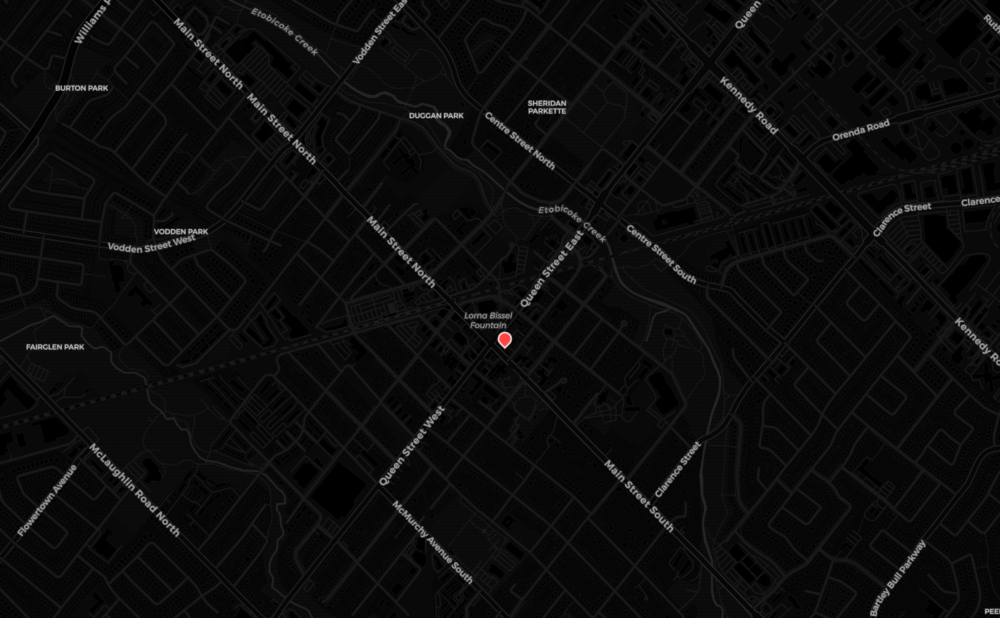

# Bored — Find a Run Near You

A mobile-first map app for discovering open basketball runs and drop-in games happening around you in real time.



## What it does

Bored lets you see active pickup games and open runs on an interactive map. No sign-up walls, no scheduling friction — just open the app and find where ball is happening near you.

- Browse live pins on a dark map UI showing nearby open runs and drop-ins
- Tap a pin to see details about the game
- Games are posted and managed in real time

## Tech Stack

**Frontend**
- React + TypeScript + Vite
- Leaflet / react-leaflet for the map
- Capacitor for iOS & Android packaging

**Backend (AWS)**
- API Gateway — HTTP API routing
- Lambda — serverless backend logic
- DynamoDB — stores location and game data

## API

| Method | Route | Description |
|--------|-------|-------------|
| `GET` | `/locations` | Fetch all active game locations |
| `POST` | `/locations` | Post a new open run |
| `DELETE` | `/locations/{id}` | Remove a game listing |

## Getting Started

```bash
cd bored
npm install
npm run dev
```

App runs at `http://localhost:5173`

## Status

Currently in active development. Core map and AWS backend are wired up. Game posting UI and user flows coming soon.
